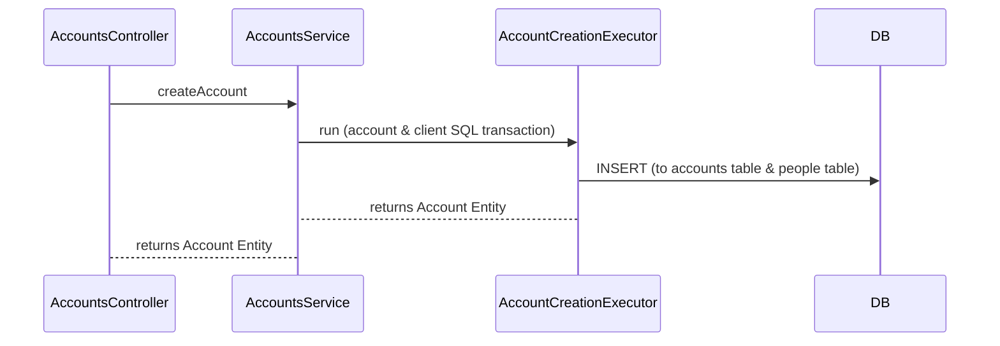
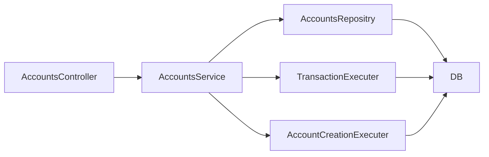

## Backend Assignmnet Server
POST /account/create - creates a new account.
GET /account/balance - reutrns the account's current balance.
GET /account/{accountId}/statement - returns an account statemant for a given account id.
PUT /account/{accountId}/block - blockes an account.
PUT /account/deposit - new deposit transaction for a given account.
PUT /account/withdraw - new withdraw transaction for a given account.

The project uses Nest.js as it's framework for the server component. The database of choise is a SQL relational database (Sqlite). The server exposes swagger ui.

### The server is designed with 3 layers:
* 1 . Controller - defines all the endpoints.
* 2 . BL 
* 3 . DAL 

## Steps
* 1 create an account with the /account/create endpoint.
* 2 deposit to the account with the /account/deposit endpoint.
* 3 withdraw from the account with the /account/withdraw endpoint.
* 4 get an account statement of the transactions by calling the /account/{accountId}/statement endpoint.
* 5 block the account by calling /account/{accountId}/block.
* 5 try any of the endpoints (balance, statement, block, deposit, withdraw) to get a Forbidden response 		        becouse the account is now blocked.

## UML diagrams

You can render UML diagrams using [Mermaid](https://mermaidjs.github.io/). For example, this will produce a sequence diagram:

flow of the components relations:

